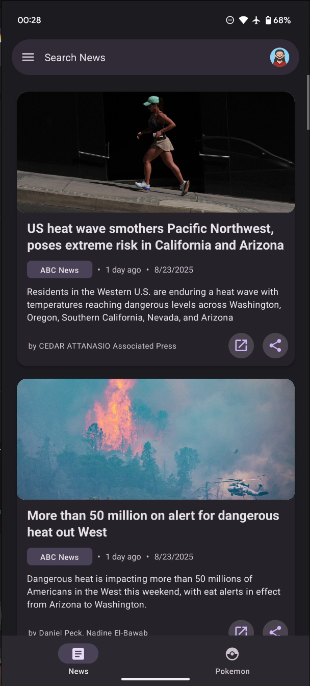
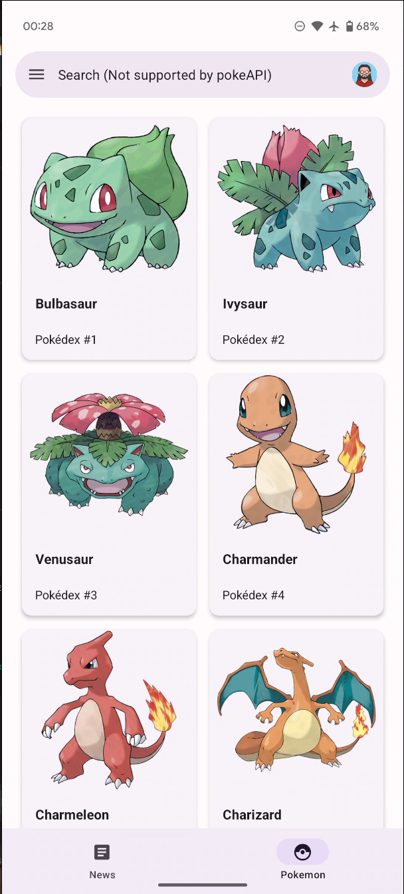
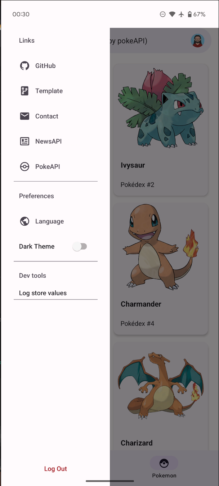
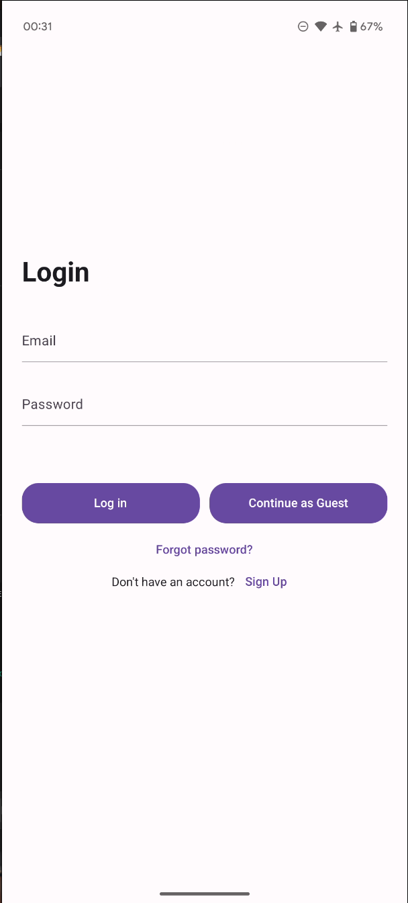
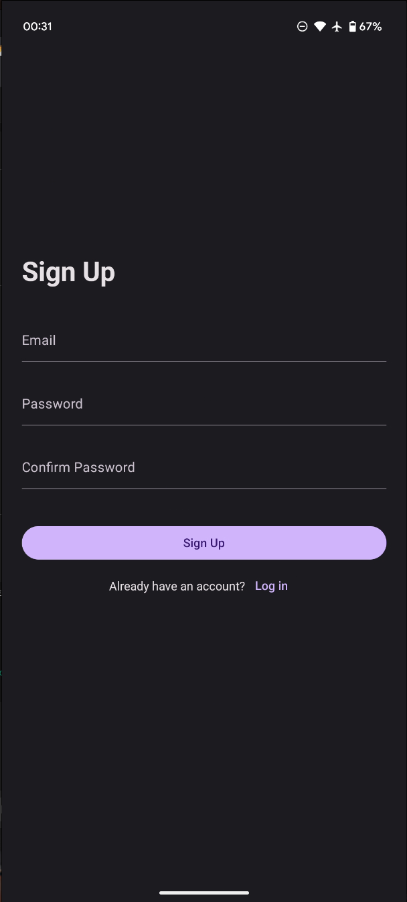
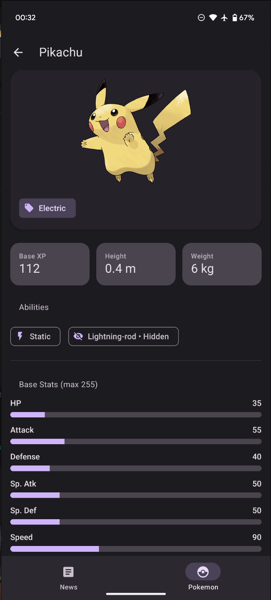

# M004 — News & Pokémon (React Native)

A TypeScript-first React Native app showcasing a clean architecture with:

- 🎨 **Custom theming** (MD3 via React Native Paper, light/dark with persistence)
- 🌐 **Localization (i18n)** with English/Spanish support and AsyncStorage persistence
- 📦 **MobX stores** for state management (auth, theme, language, UI, logs)
- 🌍 **Axios API layer** with multi-client setup, `.handle()` wrapper, JWT headers, and snackbars
- 📝 **Formik forms** with custom React Native Paper components + Yup validation
- 🔐 **Full auth flow** (login, signup, reset, logout and guest mode) with JWT persistence
- 🧩 **Atomic design structure** with helpers, hooks, services, and clean separation of concerns
- 🧭 **Custom navigation** integrating Paper with multiple stacks, bottom tabs, and a drawer

<p align="center">
  
  
  
</p>
<p align="center">
  
  
  
</p>

---

## 🚀 Quick Start

```bash
# 1) Clone
git clone git@github.com:Melkoh02/M004-News-Pokemon-App.git
cd M004-News-Pokemon-App

# 2) Install dependencies
yarn install

# 3) Setup environment variables
cp .env.example .env    # then edit API_KEY_NEWS and others as needed

# 4) Start Metro (keep this terminal open)
yarn start

# 5) In another terminal, build & run Android
yarn android
````

👉 The `.env.example` file is already in the repo:

```dotenv
# duplicate this file and remove the '.example' part / duplicar este archivo y sacarle la parte '.example' del nombre

# replace this one / cambiar esta clave
API_KEY_NEWS=3c****************************0c

# these can stay as they are / estas variables pueden quedarse como estan
API_BASE_URL_BACKEND=http://***.***.***.***:8000/api/v1
API_BASE_URL_NEWS=https://newsapi.org/v2/
API_BASE_URL_POKEMON=https://pokeapi.co/api/v2/
```

---

## 🛠 Development/Tested Environment

This project was developed and tested under the following setup.  
For instructions on preparing your own system, see the official React Native guide (highly recommended!):  
👉 [Set Up Your Environment](https://reactnative.dev/docs/set-up-your-environment)

* **OS**: Ubuntu 24.04 (dev machine)
* **Node**: ≥ 18 (tested with v22.15)
* **Java**: 17 (OpenJDK)
* **Android SDK**: Installed + `ANDROID_HOME` configured
* **Yarn**: 1.x

Example `.zshrc` snippet:

```bash
export NVM_DIR="$HOME/.nvm"
[ -s "$NVM_DIR/nvm.sh" ] && . "$NVM_DIR/nvm.sh"
export JAVA_HOME=/usr/lib/jvm/java-17-openjdk-amd64
export PATH=$JAVA_HOME/bin:$PATH
export ANDROID_HOME=$HOME/Android/Sdk
export PATH=$PATH:$ANDROID_HOME/emulator
export PATH=$PATH:$ANDROID_HOME/platform-tools
```

---

## 📜 Scripts

```bash
yarn start     # Start Metro (keep open)
yarn android   # Build & run on Android
yarn ios       # (Optional) Run on iOS
yarn eslint    # Lint with ESLint
```

---

## ✨ Features

* **Theming**

    * Extends MD3 themes with custom colors (`light.ts`, `dark.ts`, `custom.ts`, `sharedColors.ts`)
    * User preference persisted in AsyncStorage
    * Typed `useAppTheme` hook for DX

* **Localization**

    * i18next + react-i18next + react-native-localize
    * English (`en.json`) and Spanish (`es.json`)
    * Drawer toggle + device auto-detection

* **State Management**

    * MobX + mobx-react-lite
    * Stores: `rootStore`, `userStore`, `themeStore`, `languageStore`, `uiStore`, `logStore`

* **API Layer**

    * Axios clients (`client.ts`, `endpoints.ts`)
    * Custom `.handle()` wrapper
    * Automatic JWT injection from `userStore`
    * Snackbars for success/error

* **Forms**

    * Formik + Yup
    * Custom Paper inputs (`BaseFormikInput`, `FormikTextInput`)
    * Consistent styling + validation

* **Authentication**

    * Login / Signup / Forgot Password / Logout / Guest Mode
    * JWT token
    * Auto-attached to requests
    * Secure logout clears storage

* **Navigation**

    * `@react-navigation/native` + stacks + bottom tabs
    * Stacks: `AuthStack`, `NewsStack`, `PokemonStack`
    * TabNavigator integrates MD3 look with Paper
    * Drawer with theme & language toggles, useful links

* **Good Practices**

    * Atomic design
    * Helpers/hooks (`timeAgo.ts`, `toggleLanguage.ts`, `useApi.ts`, etc.)
    * Typed API models and theming
    * Clear folder separation

---

## 📂 Project Structure

```plaintext
src/
  api/            # Axios clients & endpoints
  assets/         # Fonts and images
  components/     # Atomic components (cards, inputs, modals, drawer, etc.)
  lib/            # Reusable logic split into:
    constants/    # Static constants
    helpers/      # Utility functions
    hooks/        # Custom hooks
    providers/    # Global providers
    stores/       # MobX stores
    types/        # Shared TypeScript types
  localization/   # i18n setup with locales (en.json, es.json)9
  pages/          # Screen components (Auth, News, Pokemon)
  routes/         # Navigation stacks, tabs, and route config
  styles/         # Global styling (spacing, globals.css)
  themes/         # Light/Dark/Custom themes + shared colors
```

---

## ⚙️ Development Tips

* Always run `yarn install` after adding new deps
* **Metro**: keep `yarn start` running in one terminal
* **Android build**: `yarn android` in a separate terminal
* Reset Metro cache if needed:

  ```bash
  rm -rf $TMPDIR/metro-* && yarn start --reset-cache
  ```
* Emulator debugging: `adb devices`

---

## ❓ Troubleshooting

* **Build errors** → verify **Java 17** and **Android SDK** paths
* **Env not applied** → after editing `.env`, rebuild (`yarn android`)
* **Network issues** → check `API_BASE_URL_*` values and emulator network
* **Contact Dev** → contact@melkoh.dev

---

## 🙌 Credits

* [React Native](https://reactnative.dev)
* [React Native Paper](https://callstack.github.io/react-native-paper/)
* [MobX](https://mobx.js.org/)
* [React Navigation](https://reactnavigation.org/)
* [i18next](https://www.i18next.com/)
* [Formik](https://formik.org/) + [Yup](https://github.com/jquense/yup)
* [Axios](https://axios-http.com/)
* [PokeAPI](https://pokeapi.co/)
* [NewsAPI](https://newsapi.org/)

---
